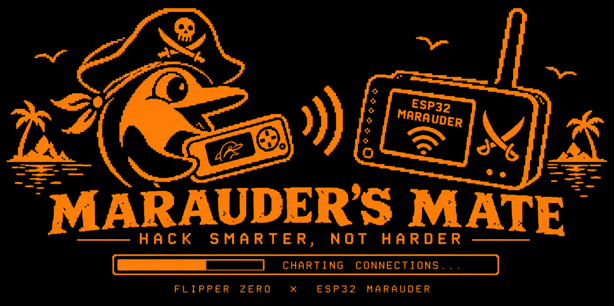

# Marauder's Mate



A friendlier Flipper Zero front-end for the ESP32 **Marauder** firmware.

This is a fork of [0xchocolate/flipperzero-wifi-marauder](https://github.com/0xchocolate/flipperzero-wifi-marauder).
The upstream app is excellent, but it is essentially a serial terminal: it builds
Marauder CLI commands for you and dumps the raw ESP32 output to a text box.
**Marauder's Mate** aims to parse that output into navigable, actionable UI —
e.g. turning a `list -a` scan into a selectable list of access points you can
target directly, instead of reading raw text and typing indices back in.

Requires a connected dev board running Marauder FW. See the upstream
[install instructions from UberGuidoZ](https://github.com/UberGuidoZ/Flipper/tree/main/Wifi_DevBoard#marauder-install-information).

## Status

Early but functional. Alongside the full upstream menu, a new **Scan APs (Mate)**
entry scans, parses `list -a`, and shows a selectable access-point list; picking
one opens a detail screen with Deauth / Sniff / PMKID actions that target that AP.
Not yet tested on hardware -- feedback from a real board is welcome.

## Roadmap

- [x] Parse `scanap` / `list -a` output into a structured AP list
- [x] Selectable AP list -> detail screen -> actions (`select -a <n>` +
      deauth / sniff / PMKID)
- [x] Live `scanall` view: streaming, deduped by BSSID, growing list with
      per-AP client counts; targets the exact BSSID via a discovery-order ->
      `list -a` index bridge (`select -a <index>`)
- [x] Stations drill-down: per-AP station MACs (from scanall associations,
      deduped) under each AP; client count is unique clients
- [x] Targeted client deauth: list -c stations under each AP (with select -c
      indices), pick a client -> select AP + client -> attack -t deauth -c
- [ ] 5GHz + Bluetooth/AirTag: blocked by ESP32-S2 hardware (WiFi-only, no BT)
- [ ] Parse SSID (`list -s`) list similarly
- [x] Fox Hunt RSSI meter: live strength bar + big dBm readout + peak-hold,
      to physically home in on a selected AP (foxhunt -w <ap>)
- [ ] Live status line (current channel, selected target counts)
- [x] Prune redundant menu items now covered by Live Scan (dropped our old
      Scan APs flow + top-level AP Info / Fox Hunt; removed the orphaned scenes)
- [x] L3: Join a network + host discovery (pingscan -> list -i) from the AP
      detail; parsed host-IP list. (portscan deferred: `-a -t` is a no-op and
      `-s <service>` output couldn't be captured reliably on this board)
- [x] Beacon Monitor: sniffbeacon parsed into a live list deduped by BSSID,
      counting beacon frames per AP, sorted noisiest-first (a beacon-spam
      detector)
- [x] Probe Monitor: sniffprobe parsed into a live list of client devices
      (deduped by MAC), counting probes and showing the SSIDs they seek
- [ ] Deauth Monitor: deferred (needs a real-deauth capture to verify format)
- [x] Targeted attacks clear prior selections first (Marauder's select
      accumulates), so a second attack doesn't also hit earlier targets
- [ ] Keep raw-console view available as a fallback / "advanced" mode

## Build

Uses [`ufbt`](https://pypi.org/project/ufbt/):

```sh
python3 -m venv .venv && . .venv/bin/activate
pip install ufbt
ufbt            # build -> dist/marauders_mate.fap
ufbt launch     # build, upload, and run on a connected Flipper
```

## Auto-join (optional)

Tapping **Join** on a network normally prompts you to type the password on the
Flipper. If you'd rather one-tap join your own networks, drop a file on the SD
card at `/ext/apps_data/marauder/networks.txt` listing SSID/password pairs; when
the tapped AP's SSID matches, the app joins without prompting. See
[`networks.txt.example`](networks.txt.example) for the format.

> ⚠️ **This file is plaintext on an unencrypted, removable SD card.** Anyone who
> gets the card can read every password in it. Put only your own networks here,
> and treat a lost Flipper as lost passwords. The real file is gitignored; only
> the placeholder example is tracked. (Note: Marauder echoes the password in its
> own join output, so a saved console log will also contain it — the same as a
> manually typed join.)

## License

GPLv3, inherited from upstream. See [LICENSE](LICENSE). Original work by
0xchocolate and the ESP32 Marauder companion contributors.
